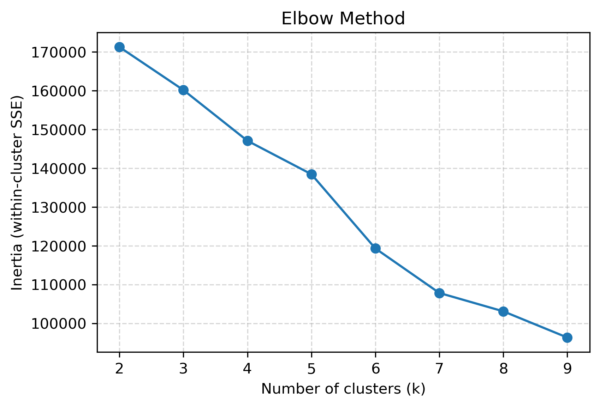
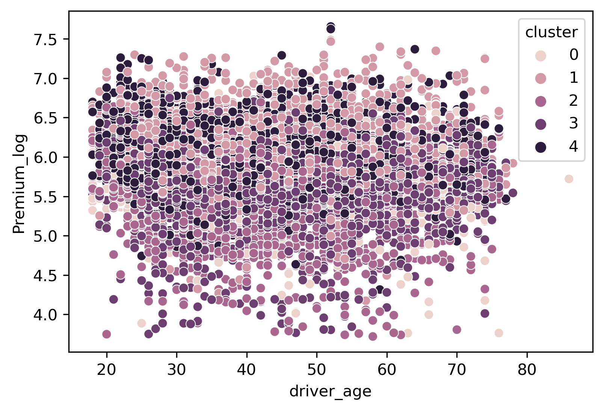
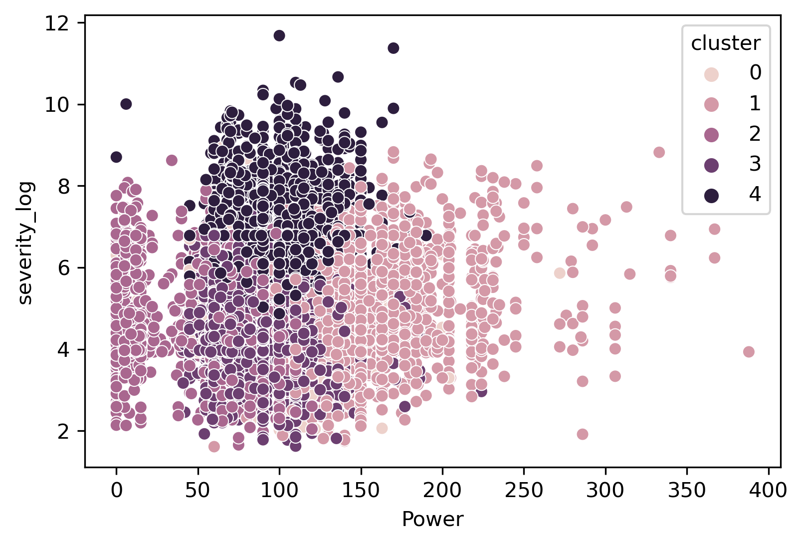

This project applies K-Means clustering on an auto insurance portfolio to segment policyholders based on vehicle and claim characteristics. Using Elbow and Silhouette analysis, it determines the optimal number of clusters and visualizes customer segments for insights into pricing, risk assessment, and fraud detection

##  Visualizations

**Elbow Method**

**Silhouette Analysis**

**Clusters by Vehicle Value vs Severity**

**Clusters by Age vs Premium (log)**

**Clusters by Power vs Severity (log)**

